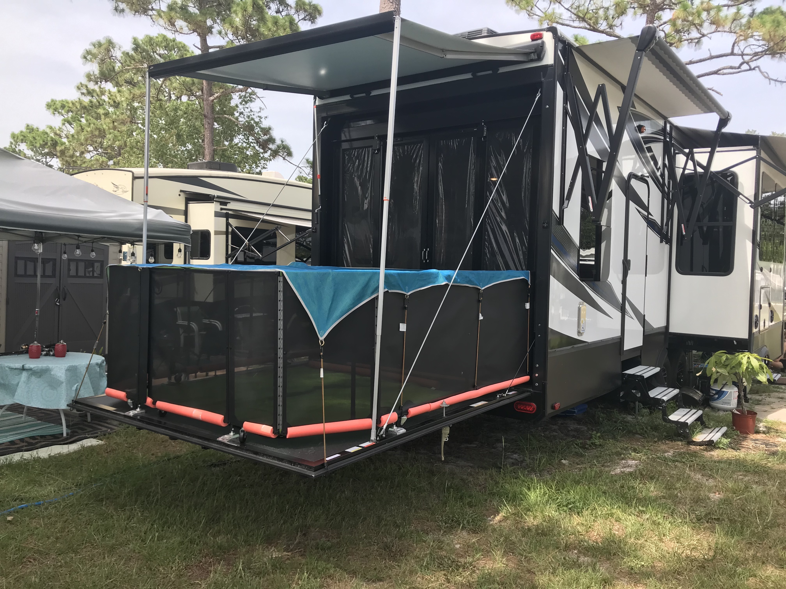
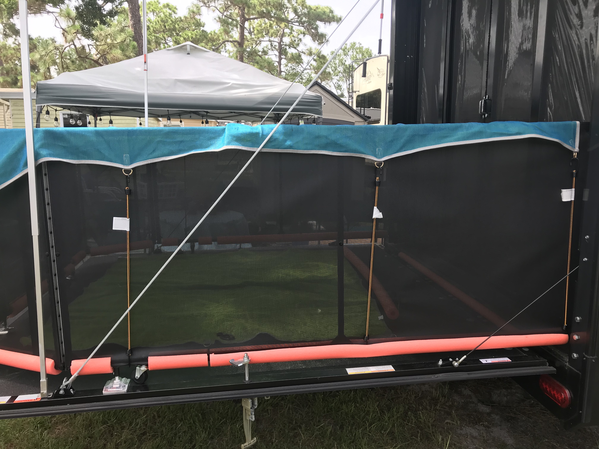
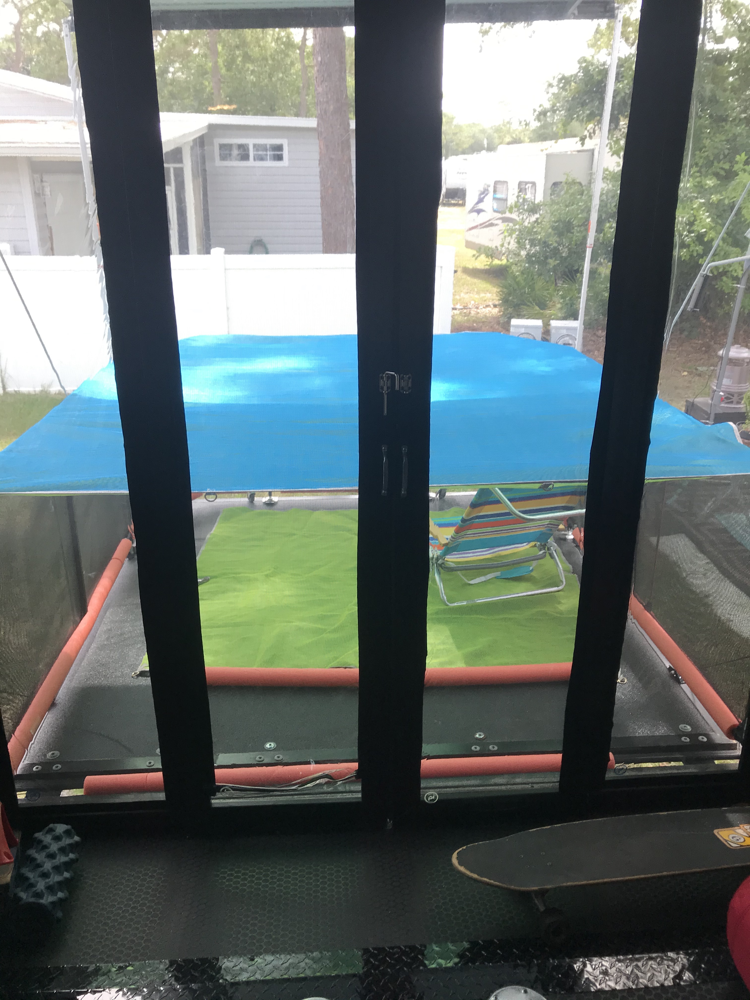

It’s a patio for our cats!

One of the reasons we purchased our [Grand Design Momentum 350m](https://www.granddesignrv.com/showroom/2018/toy-hauler/momentum/floorplans/350m) was for its patio option. This option turns our toy hauler’s ramp door into a patio set complete with awning and rails. We got lucky and the previous owner opted for the patio and 3 season doors (even the Momentum branded chairs ftw!) But really we bought a big fifth wheel because we have cats. We didn’t want to coup them up in a small Class C or \#vanlife. These cats are our children. Toby and Rupert are spoiled-fuckin-rotten. 

Before we moved into the RV we were renting a 4 bedroom 3 bath house with a pool. Our cats loved being out on the pool deck watching the squirrels and birds, sunning themselves and rolling around in the dirt. So of course when rv shopping we had to consider their comfort and needs. 

Our Momentum’s patio deck makes for a perfect _“catio.”_ 
 
 
*TLDR* 
* Buy a toy hauler with patio ramp door
* Buy large enough soundproof mat from REI to cover patio
* Use bungies to secure mat to rails
* Fill gaps between floor and rails with pool noodles to keep cats inside
* Cut hole in screen door for cats to get in and out
* ???
* profit

 

A couple years ago I bought a [6x6 sandproof mat from REI ](https://www.rei.com/product/130163/cgear-multimats-original-sand-free-mat) which we used to lay on the floor of the patio for us humans to enjoy since the ramp is a rougher texture. I remembered that REI sold larger versions of the mat, (6ft, 8ft, and 10ft)  which I realized could fit over top the railing and completely cover the patio. The patio rails are just under 8ft across. 

So I ordered a [larger mat]( https://www.rei.com/product/130163/cgear-multimats-original-sand-free-mat) which measures 8x8. I then went to Ace hardware and picked up 24” bungie cords to secure the mat to the rail. The mat already has rings sewed in which makes securing it easy.
The gap between the floor of the deck and the bottom of the rails is big enough even for a fat cat to squeeze his chunky butt through and sneak out, so we bought pool noodles and cut along its length to fit around the bottom rail and fill in the gap.

 
 
We bought 6 pool noodles from Publix for $2 each. We went with the thinner diameter noodles. There's still a gap but I don't think it's big enough for fit through. With the thinner noodles they don't have to come off before closing the patio up.  

Since we have the 3 season doors I was able to pop out the screen on the bottom of one of the doors and roll it up to function as a cat door. That way (some of) the AC stays in the RV and the cats can go in and out. 

Toby likes to dive-bomb from the bunk bed onto the the mat.

The mat sits up high enough that we can still sit or lay out there and enjoy the sunshine, fresh air, and birds.
 
 

