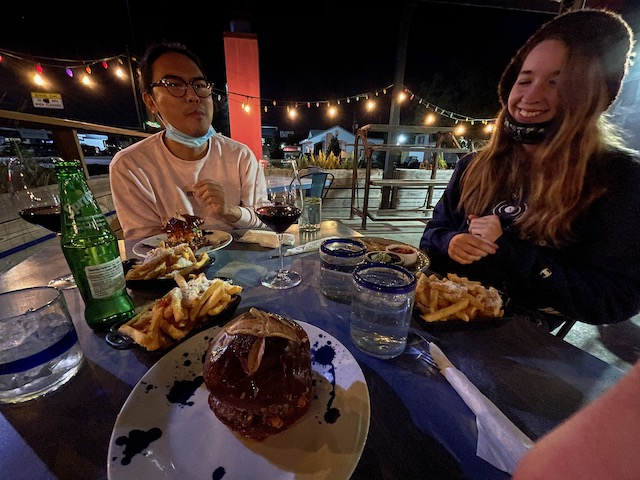

It’s been pretty quiet at the park.
The neighbors we had over summer are still here.
But the neighbors on the other side whom happen to also have a Momentum are moving out. They’ve sold the rig and the truck is for sale. They said they bought a house and are buying an Outback. I don’t think they had their Momentum much longer than we did. But due to their age and COVID they’re getting out of it.

I’ve been doing a lot truck shopping.
As much as we like our Momentum it’s too big and cumbersome to move frequently. The 350m is perfect as a tiny home and minimalist living setup but travel daYs are rough.
It’s just a bit too much truck and trailer for us so we’re thinking of downsizing.
I hate to get rid of the Outback. It’s barely at 8k mi. But ideally we need to be in one vehicle.

For some reason I kinda want to trade for a Raptor. It’s got all the same features the Outback has and twice the power. The only drawback is it tops out at
 8k towing capacity and 1200lb cargo capacity. Which will fill up fast.

I grossly underestimated the weight of our momentum mated to our F350’s tow specs. I don’t wannna do that again.

 

We finally got some [Bem Bom](https://bembomfood.com/) with Mike. It was cold as hell eating outside but totally worth it. I’ve had many burgers over the last few months on our travels and Bem Bom's Lamb Burger is the best.

Full timing is fun but we do miss our old house.

Super glad I took Friday and the following Monday off.

I signed up for skill share to finally learn more about my camera and get some editing done while I’m off.

It’s an odd feeling to be editing the footage from the beginning of our trip now that we’ve completed the whole Loop.

As I write I’m watching us leave Florida for the first time and venture into Georgia.
Barely 200mi into now a well over 2000mi round trip. We had much to learn.

 

It’s my day off which means jack-all when you’re RVing. We let the boys out to get some sun and roll in the dirt. While watching them crawl under the trailer I noticed a drop of water fall from the basement locker. Then another. And another.
Upon opening the locker there was a line of water along the back wall. So I quickly pulled everything out which revealed even more water.
I grabbed my screwdriver and pulled the back walls out and behind it was EVEN MORE WATER.
It was clean water, which meant it wasn’t coming from the bathroom. So I looked all over the lines coming in from the Nautilus.
It turns out there was a tiny leak in the housing of the water pump itself.
Which means it has been leaking for a long time.
I inspected the basement for leaks before we left Ohio, so at some point since we left it started leaking. I’m not sure what could have caused such a leak. It hasn’t gotten that cold for it to freeze, and its not been that hot.

A new pump is on its way though its shipping time has been extended because it’s almost Christmas.
In the mean time I rigged it so the pump will drain into a compartment I had already drilled holes in the last time I flooded.

Looking forward to this weekend.
