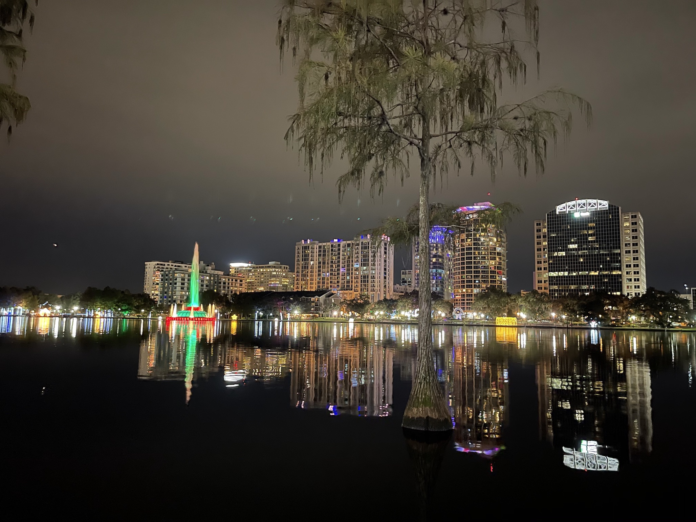

Saturday was spent cooking and napping.
There’s a Camping World on the other side of the park we’re staying at. So we shopped around and toured a handful of RVs. We like our Momentum but it’s so big. After 8 months in our current rig we know what we like and don’t like.

We moved our Thanksgiving of 2 to Saturday since we traveled on turkey day.

I’m thankful we only have 1 more day of travel left in the year.

Rough Sunday morning.
Five minutes before we're supposed to leave for Florida, Caitlin almost ripped the steps off the rv using the Subaru's front bumper.
Then we sat in traffic that made our 3 hour drive take 4 hours.

The office made us wait 20 plus minutes to park. 
Their new policy is that someone has to park you. The gentleman that parked us  was zero help. I couldn't hear or see him when parking. 

It’s been a rough fucking week. Works been crazy. Multiple projects and releases happening.
We hired a new guy and had a fun happy hour downtown Orlando. I hadn’t seen anyone from the office in person since March when we went Remote.

Tonight we’re getting dinner with our friend Mike.

It felt good to wander around Lake Eola again. We lived there for a year, just a couple years ago.

I put in for some much needed pto.

It is nice to be back in Florida. The familiarity is almost odd. After several months away, not much has changed. But something is different. Maybe I feel different.

