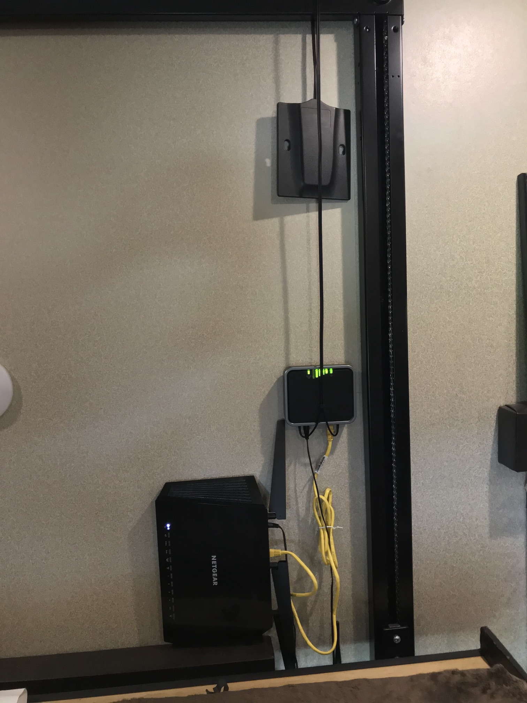
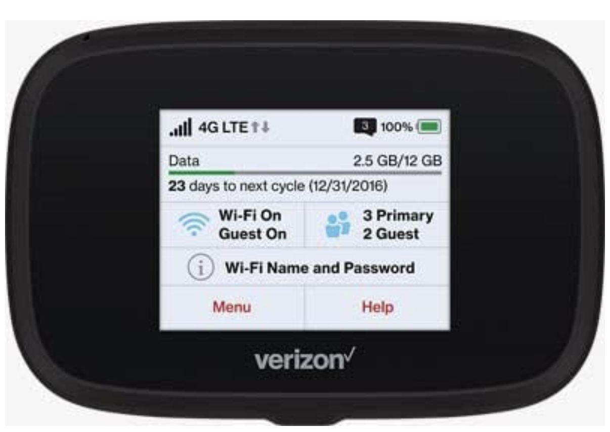
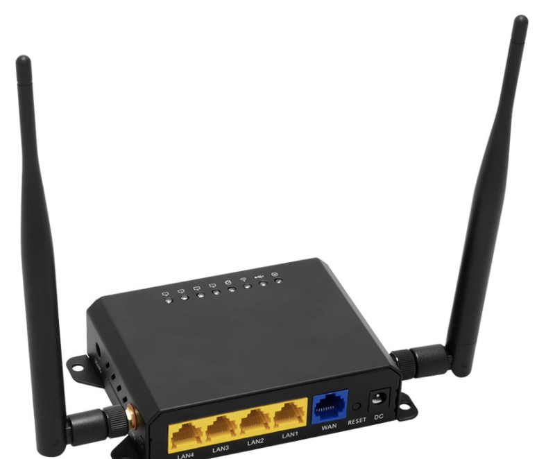
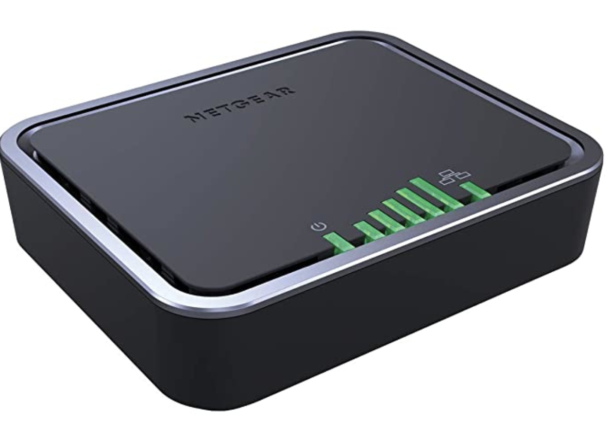
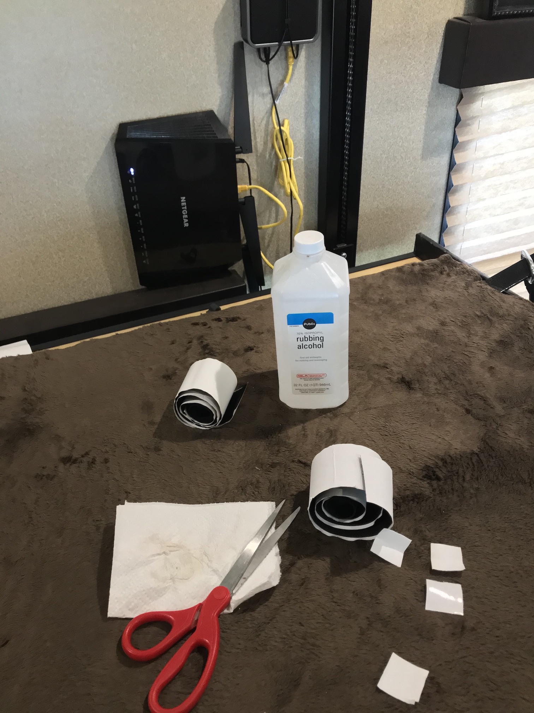
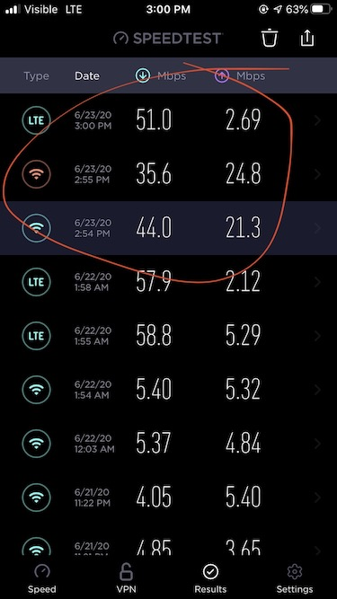

Today is Tuesday June 16th, 2020.

In preparing to go full-time I looked at how other RVers did their internet setup. As you can imagine there are hundreds of ways to get connected. Hotspotting straight from your phone, to buying a dedicated mobile hotspot like a jetpack (don’t do that), to turning your RV into a hotspot itself. The options are endless.

The finished product. Netgear aircard, with MIMO antenna connected to a Netgear Nighthawk router.
 

 

*TLDR*:
* We use Visible (Verizon network).
* Bought a Verizon Jetpack 7730l which didn’t work.
* Switched to a Netgear aircard attached to a wifiranger router for internet. Works ok.
 

 

I settled on switching my phone plan to [Visible](https://www.visible.com/) wireless because they have a supposedly ‘unlimited’ plan at the time of writing (June, 2020).
For the last couple weeks I was just hot spotting everything from my phone. My laptop for work. My Roku tv. Even my Kindle. But having to connect to my phone every time I wanted to watch Netflix or YouTube was annoying.

I read that some people had used a Jetpack and a wifi router. So I thought, “cool I’ll get one of those and pop my Visible sim in. No problem”.

I bought a [Jetpack 7730l](https://www.amazon.com/gp/product/B076HSWM8S/ref=ppx_yo_dt_b_asin_title_o04_s00?ie=UTF8&psc=1) off amazon ‘refreshed’ for $140. 

Hoping it would allow me to use my sim and eventually buy a second line for it. I saw that other RVers had used it. I went ahead and bought a [MIMO antenna](https://www.amazon.com/gp/product/B00DN3J03O/ref=ppx_yo_dt_b_asin_title_o01_s00?ie=UTF8&psc=1)
to go with it.

I didn’t think I’d need the router just yet. I figured a Jetpack would be the easiest and quickest option to get us started. Boy was I wrong.  The Jetpack crashes and restarts every 2 mins. I read that some people got away with using it  with wifi off and tethered to a raspberry pi as the router. I wasted an afternoon messing with an extra raspi I had. Trying to turn it into a router. No luck. After hours of frustration I ordered a [WifiRanger Poplar](https://wifiranger.com/shop/routers/indoor/poplar/) router.

UPS charged me \$20 to send back the busted hotspot. Hoping the return goes smoothly.

I went with the [WifiRanger Poplar](https://wifiranger.com/shop/routers/indoor/poplar/) because it specifically lists the 7730l as compatible to tether over usb. 

A week later the router is delivered. So I plug the jetpack into the router. Get it configured. Finally I’m connected. Or so I thought. The Mifi Jetpack crashes again and again. Regardless of whether it’s in WiFi or usb tethered mode. Back to square one.

Tomorrow a [Netgear aircard](https://www.amazon.com/gp/product/B01N5ASNTE/ref=ppx_yo_dt_b_asin_title_o00_s00?ie=UTF8&psc=1) should be delivered. Amazon next day ftw.

The aircard functions similar to how a jetpack or hostspot works. Just put in a SIM card.

 

Today is Wednesday June 17th, 2020

The Netgear aircard works really well. The antenna seems to add a couple bars of signal, which is critical being in Wekiva Falls. My phone said I had 2 bars. The aircard is almost full signal.
As I’m writing this I’m watching a YouTube video in 1080p on my roku tv. I’d say it’s a success.
After a successful trial run I ordered another SIM card dedicated to the aircard. No more swapping sims or turning on or off hotspots.

It's a simple enough process:
* Order the SIM.
* Activate it with your phone. 
* Make sure the APN settings are correct for the aircard.
* ???
* Profit.

I noticed the aircard defaults Visible to Verizon's apn. Changing it to `"vsblinternet"` gets it to connect.

To mount everything I just velcroed it to the wall. Just make sure you use alcohol to clean everything so it sticks firmly.
Since we're in a Momentum toy hauler, I mounted it in such a way that the Happijac bed can still go up and down without interferring with the router. The power outlet is directly below where it's installed.

For better or worse we’re all in on Verizon’s network. My phone, her phone, and the aircard. If we don’t have Verizon, we don’t have internet. I don't trust park wifi. We’ll have to make sure Verizon is nice and strong when we’re on the road. I also didn’t need to buy the wifiranger since I already had a router from our house. At least it's small and sits on the wall easily.

 

You can see the upload speeds increased dramatically. Which is important for when we're in video calls and meetings.
Just hotspotting from my phone speeds are capped at 5mbps, and upload speeds are terrible. Using the aircard and router boost speeds considerably.

If you have any questions, feel free to email me at <dwight@neotenites.com> or DM us on instagram [@neotenites](https://instagram.com/neotenites) 

 

--- *Edit 06/22/20*  --- 

I've decided to use the [Netgear Nighthawk](https://www.amazon.com/gp/product/B00R2AZLD2/ref=ppx_yo_dt_b_search_asin_title?ie=UTF8&psc=1) router I already had. The ranger works ok, I just prefer the Nighthawk since it has 5ghz and 2ghz. If anyone wants a WifiRanger email me. Like new, free shipping. 

Tags : internet, tech, gear, lifestyle,
