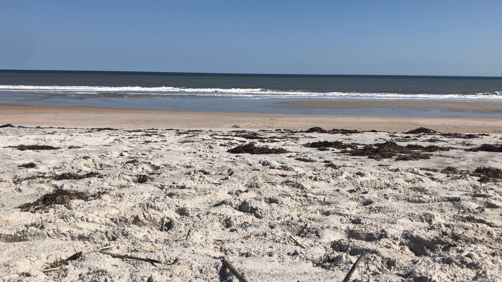

The park went from no people one day to jam packed the next. There was a drive-in golf cart concert going on our last weekend on the Suwannee. Our private bird sanctuary filled up quickly. These people partied all night. 

We packed up and headed to Kathryn Abbey Hanna Park in Jacksonville Beach, Florida.
It was only a 2 hour drive. 

Driving through Jacksonville was a bit surreal and nostalgic. We lived in Jacksonville for 2 years in 2012. It was the first place we moved to after high school.

It's where I started learning to code while pushing carts at Home Depot. She was in school at UNF. And it's where we got Rupert. I used to drive my Miata home from work. Now I'm taking my home with me.

It's crazy to look back and see how far we've come.

My brother was also stationed at Mayport, right around the corner from Hanna Park.

I had a bit of culture shock driving to get our Covid tests. 
After months of driving in small towns and rural country roads, we have to drive down A1A in Jacksonville Beach. It just seemed much more hectic and crazy compared to Bellville, Ohio.
Hanna Park is really nice.
It was nice to be able to enjoy my morning tea on the beach. After standup I would enjoy a bit of sunbathing.

There's tons of bike trails. Makes us wish we had bikes already. Unfortunately the weather hasn't been cooperating. A cold front moved in when we did. So it has been beach weather. Too cold, too windy, and a few days of rain put a real damper on our visit. But I'm sure we'll be back.

In the morning we head to St. Augustine.

