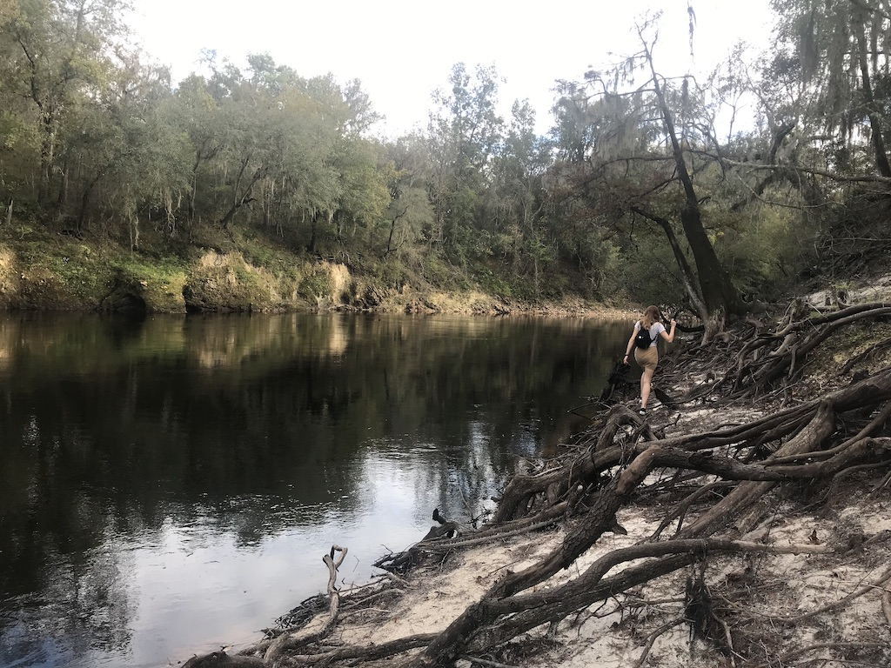

We had an amazing canoe <b>trip</b> with our friend Sabrina.
Afterwards we have a nice campfire, beers and dinner.
The next morning Sabrina heads to North Carolina.
All our friends have left now. 
We went to one of the ‘secret’ beaches I found the other day. While we were exploring the beaches, another couple showed up at our spot and decided to go skinny dipping. After an awkward conversation they left. 

I've been keeping an eye on the forecast track for Hurricane Eta. The weatherpeople had it going back into the gulf, but it ended up heading to Jacksonville. Eta was nice enough to spare us anything major. 

We squeezed in a quick hike at [Big Oak trail](https://floridahikes.com/big-oak-trail), which runs along the Suwannee. We hiked this trail once almost exactly a year ago.

