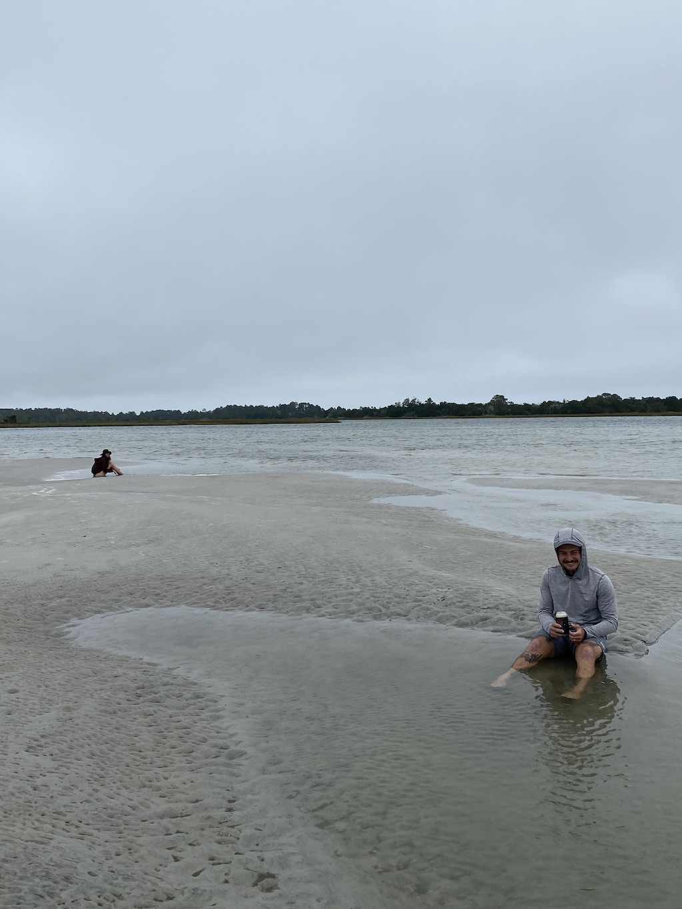
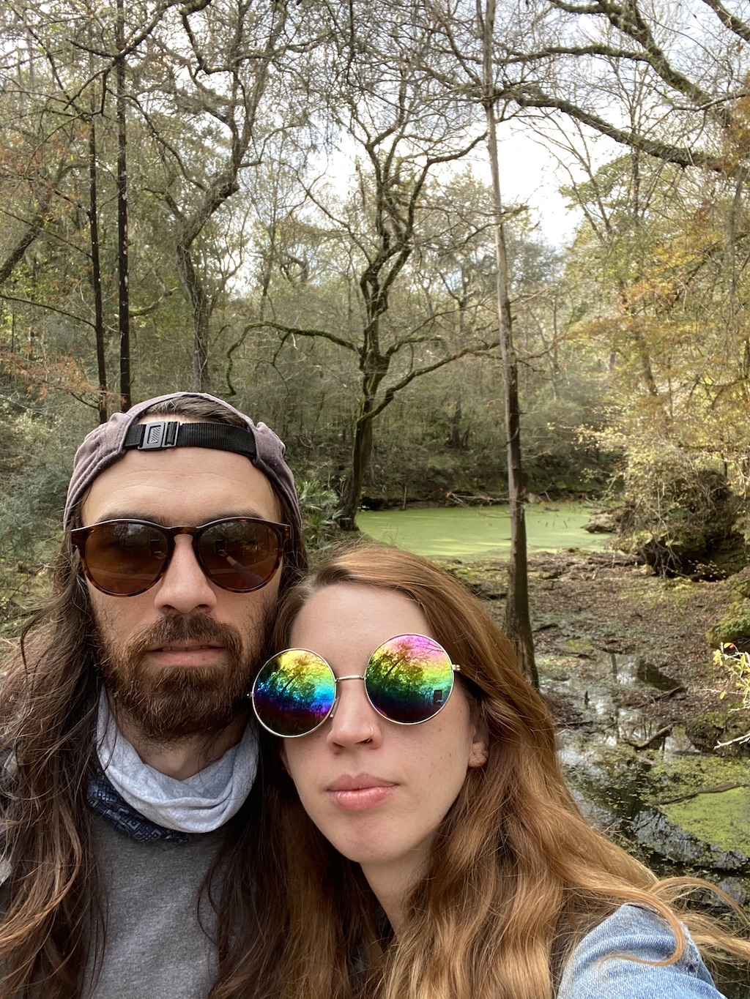

We made it out of Hanna Park and down to St Augustine.
The internet here is crap and cell signal is bad.

It’s thanksgiving week, so we got to see some old friends and go kayaking. 
I think we prefer canoeing over kayaking.
Afterwards we had a nice Friendsgiving and ate and played games. 

Our friends Sam and Cheyenne came down from Jacksonville to wander around St Augustine with us. They met us at the Blue Hen for breakfast. Then we caught a buzz doing a wine and distillery tours and tastings. 

We spent Thanksgiving Day traveling to Valdosta. We came here thinking we’d go to Wild Adventures but it’s closed this weekend. After 3 hours of travel nobody wanted to cook so instead we ordered Cracker Barrel sine it’s close. So instead we popped back down into Florida for the day and hiked around Suwannee State Park. 

It was a really pretty and very interesting hike. With old Civil War earthworks and gravestones from the 1800’s.

I think we’ll come and stay at the State Park one of these days.

For Thanksgiving last year we went from Suwannee to Savanna Georgia to St Augustine.
This year we went St Augustine to Georgia to Suwannee.

On the way home we stopped at Publix to get some groceries so we could cook our own Thanksgiving tomorrow.

