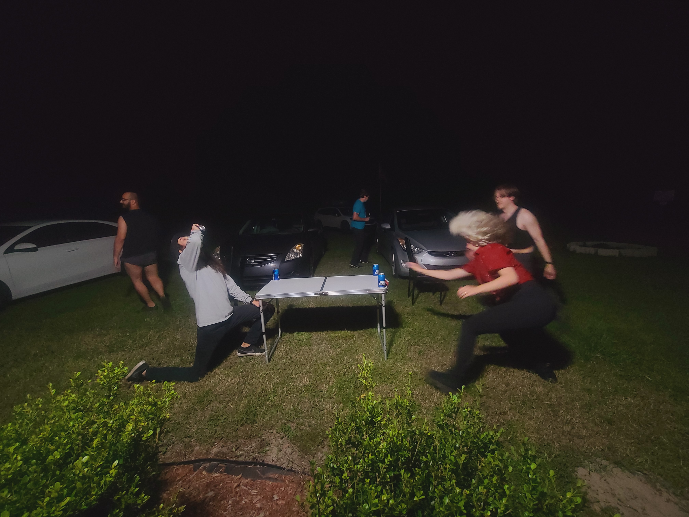

# week of Nov 6
What a week it’s been.
Halloween was a blast. We got to party with our friends we haven’t seen in months. The Suwannee has been gorgeous.
Our friends got an airbnb near by and we’ve just been bouncing back and forth.
We even had a few guests stay with us in our RV. Our good friends Amy and Nick took our spare bed since it was going to be too cold to tent camp.
And we have another guest joining us this weekend.

Toby’s eye has healed well. He had us worried for a few days. But he’s fine now.
The boys are happy to be back at the Bird Sanctuary. They like to explore the field around the rv.

The election happened. It was nice to be around friends during the first few tense hours.

Until next time friends.

The music park has a ton of golf cart trails that are super fun to rip around on my onewheel. But as i was heading back home i crashed hard. but i did find a couple other beaches besides the main swimming area.

