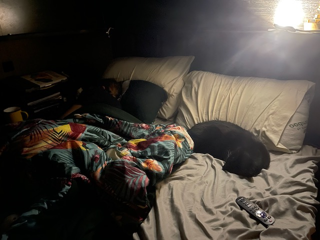

What a fucking week huh?
Nazis invaded our capitol.
And I was still required to work.

Our friend Amy stopped by and we visited downtown Sanford where there’s a rad dispensary that sells some potent prerolls. After our dinner at Wop's Hops Brewing we went home and chilled and chatted a bit.

All week we binged Teen Mom which is oddly nostalgic and hilarious.
If you’re a millennial in need of escapist television, teen mom is transporting.

The search for land begins. It's becoming increasingly important for us to have a more permanent place to stay. 

Right now for the month of January it's costing us about $900 plus electric for a "premium" site.

I'm pretty sure we could buy property and pay half that.

