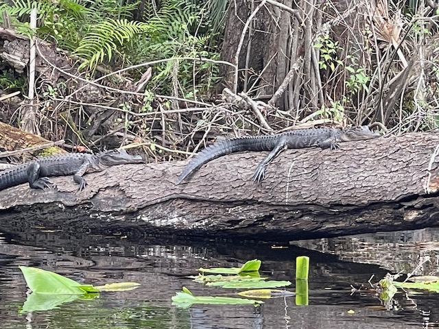

Lots to think about this week

We have company coming to visit. 
We (may have ) gone canoeing and shit.

I’ve thought a lot about trading in the Momentum but I don’t think I want to.
We think it’s a great Tiny Home but moving it gets to be stressful.

What I think I wanna do is buy a piece of land on the Suwannee River and park it there most of the time. 

The Momentum makes for a great tiny home living situation, but to move it is a chore. I’d like to figure out another way to travel faster and lighter.

We’ve wanted property for a while now, and maybe the time is coming.
I look at listings all the time. And some are surprisingly affordable. 
The hard part is finding a piece that has all the features I want.

- Sandy Beach
- Well
- Septic
- Power 

We could even start with a bare plot and collect rain water and invest in solar and batteries.

With Covid still out of control it makes sense to hunker down and wait it out.

Having a Basecamp would be hugely beneficial. 

Time will tell.

My fingers are sore from canoeing. Sabrina stayed with us and again went canoeing down the Wekiva river. 
We saw so many gators. Probably the most I’ve seen on one canoe trip. Gators of all sizes on logs and grassy banks. 

Lots of fun games like Among Us and Jackbox this week. Some people had birthdays. 
We’ve watched Survivorman Bigfoot almost everyday this week. 

It’s only the third week and I feel like it’s only just now that we’re settling back in. 

I fixed the water pump. It’s a pretty straight forward job. 
A quick google search brings up plenty of how-tos. 
Easy but time consuming. And made all the more difficult by the cramped space. If I did yoga it wouldn’t have been so rough. My back was killing me afterwards. 
Now the pump sounds like it should. 
For the longest time our old pump just wouldn’t stay off. It’d pump then take a 10 second break and cycle again. Then it finally cracked. 
I checked again today and no leaks. 

The rest of the evening was spent making burritos. Some bomb-ass burritos. 
